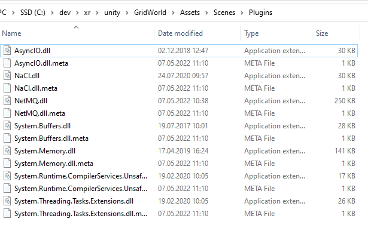

Having fun with Python and Unity.

https://openai.com/blog/emergent-tool-use/

Folder structure:  
xr / flatbuffers  
xr / flatbuffer-build  

Install CMake... (https://cmake.org/download/)  
Run the latest installer (e.g. cmake-3.20.0-windows-x86_64.msi)  
Within the terminal navigate to the "flatbuffers" folder and execute:  
git clone https://github.com/google/flatbuffers.git flatbuffers  
Open CMake and specify the "flatbuffers" folder as source directory  
Specify the "flatbuffers-build" as build directory, then Configure and Generate.  
Open the project solution and build the solution (Release).  
Next build the flatbuffers schemas with the flatc compiler.  
Within the terminal navigate to the flatc.exe located at flatbuffers-build\Release and execute:  
.\flatbuffers-build\Release\flatc.exe --python -o pose pose\schemas\req.fbs pose\schemas\rep.fbs

<!-- Download .zip from https://github.com/zeromq/libzmq  
In CMake specify xr/unity/libzmq as source and xr/unity/libzmq-build as build folder.  
Configure, Gernerate, Open Project, switch mode to Release, and make project.   -->

Visit https://zeromq.org/get-started/, select C#, pick the NetMQ library (follow the github link: https://github.com/zeromq/netmq).  
Download the .zip project netmq and build a Release version.  
Afterwards I copied the content of the folder xr\unity\netmq\src\NetMQ\bin\Release\net45 into xr\unity\GridWorld\Assets\Scenes\Plugins.  
Unfortunately, there happened to be some compilation errors, since some dlls are trouble makers (assumption already added to unity).  
So we just keep the depicted subset of ddls:  

Unity automatically detects all the dlls and will try to compile the C# script again.  
I have not found a way to gracefully force unity to recompile my script, but everytime a change happens to the Assests unity will update it.  
So a new blank line in the script is sufficient to force unity to recompile it.  
